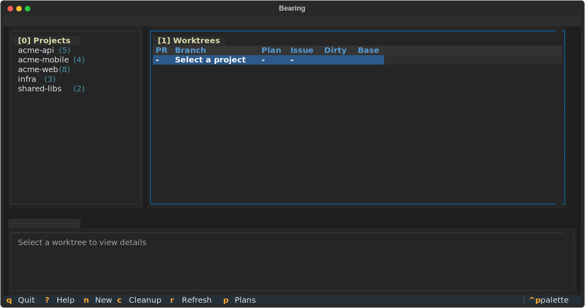

<p align="center">
  
</p>

<h1 align="center">⚓ Bearing</h1>

<p align="center">
  <strong>An agentic coding philosophy. One conversation. Full control.</strong>
</p>

<p align="center">
  <a href="https://bearing.dev"></a>
  <a href="https://github.com/joshribakoff/bearing/actions"></a>
  <a href="https://goreportcard.com/report/github.com/joshribakoff/bearing"></a>
  <a href="LICENSE"></a>
</p>

<p align="center">
  <a href="#-the-philosophy">💡 Philosophy</a> •
  <a href="https://bearing.dev">📖 Docs</a> •
  <a href="#-quick-start">🚀 Quick Start</a>
</p>

---

## 💡 The Philosophy

**Vibe with a single agent.** You work in one conversation with one orchestrating agent. No terminal flipping. No context fragmentation. When you need parallel work, the agent delegates to background sub-agents and keeps you posted.

**You control concurrency.** You decide what runs in parallel, what to background, what needs your attention. The agent orchestrates, but you're always in the loop.

**Not another framework.** This isn't some third-party agent framework you install. It's just Claude Code receiving hooks and instructions from Bearing. Fire up normal `claude` CLI and go.

**File system as interface.** Your workspace is laid out for parallel swarms — worktrees for isolation, JSONL files for state, `plans/` for tracking work. No databases. No services. Just files.

**Pattern over tool.** Bearing is more of a philosophy than a product. We provide tools (CLI, TUI, daemon) but the core idea is the workflow pattern itself. Fork it. Adapt it. Make it yours.

**AI for your AI.** Not an agent orchestrator. A *multiplier*. One Claude session sees all your plans across all repos. Say "implement all the auth-related plans" and watch it spin up 20 PRs across 5 repos. No session management. No workflow definitions. Just amplified capability.

---

## ✨ The Result

- **No contention** — Background agents work in isolated worktrees
- **No context bloat** — State lives in files, not your conversation
- **Full visibility** — See all active work in one place
- **Orchestrate everything** — From one conversation, coordinate many

---

## 🖥️ Beautiful Terminal UI



Browse all your projects and worktrees. See health status at a glance. Vim-style navigation.

---

## 🚀 Quick Start

### 1. Install

```bash
git clone https://github.com/joshribakoff/bearing ~/Projects/bearing
~/Projects/bearing/install.sh
```

### 2. Vibe with Claude

```
> Create a worktree for the auth feature
> Kick off a background agent to refactor the API
> What's the status of my parallel tasks?
> Clean up the merged feature branch
```

That's it. Bearing integrates with Claude Code's hooks. You orchestrate from one conversation — the agent handles the rest.

---

## 📁 Workspace Layout

```
~/Projects/
├── 📦 myapp/                   # Base folder (stays on main)
├── 🔀 myapp-feature-auth/      # Worktree for auth
├── 🔀 myapp-fix-bug-42/        # Worktree for bug fix
├── 📦 api-server/              # Another project
├── 🔀 api-server-graphql/      # Its worktree
└── 📄 workflow.jsonl           # Tracks all active work
```

**Base folders stay on `main`**. Worktrees are isolated per task.

---

## 🛠️ CLI Commands

| Command | What it does |
|---------|-------------|
| `bearing worktree new myapp feature` | Create a worktree |
| `bearing worktree list` | See all worktrees |
| `bearing worktree cleanup myapp feature` | Remove after merge |
| `bearing worktree status` | Health check (dirty, PRs) |
| `bearing plan sync` | Sync plans to GitHub issues |
| `bearing-tui` | Launch the terminal UI |

---

## 🎯 Plan Sync

Keep markdown plans synced with GitHub issues:

```bash
bearing plan sync --project bearing    # Sync all bearing plans
bearing plan push plans/myapp/001.md   # Push single plan
```

Plans live in `~/Projects/plans/<project>/` with frontmatter:

```yaml
---
issue: 42
repo: myapp
status: active
---
# My Plan Title
```

---

## 🖥️ TUI Keybindings

| Key | Action |
|-----|--------|
| `0-2` | Focus panel (projects/worktrees/details) |
| `j/k` | Navigate up/down |
| `h/l` | Navigate left/right |
| `p` | **Browse plans** |
| `o` | Open PR in browser |
| `r` | Refresh data |
| `?` | Show all keybindings |
| `q` | Quit (saves session) |

Session is persisted across restarts (project, worktree selection, focused panel).

---

## 📚 Learn More

- 📖 **[Full Documentation](https://bearing.dev)** — Complete guides and reference
- 📝 **[Blog Post](https://www.joshribakoff.com/blog/deliberate-ai-use/)** — The philosophy behind Bearing
- 🐛 **[Report Issues](https://github.com/joshribakoff/bearing/issues)** — Help us improve

---

---

> ⚠️ **Fair Warning:** This thing was vibe-coded in an afternoon, rewritten in Go the same day, and had a TUI bolted on for good measure. The AI agent that built it dangerously skips permissions and merges its own PRs. Depend on it at your own peril. 🏴‍☠️

<p align="center">
  One conversation. Many agents. Full control.
</p>
