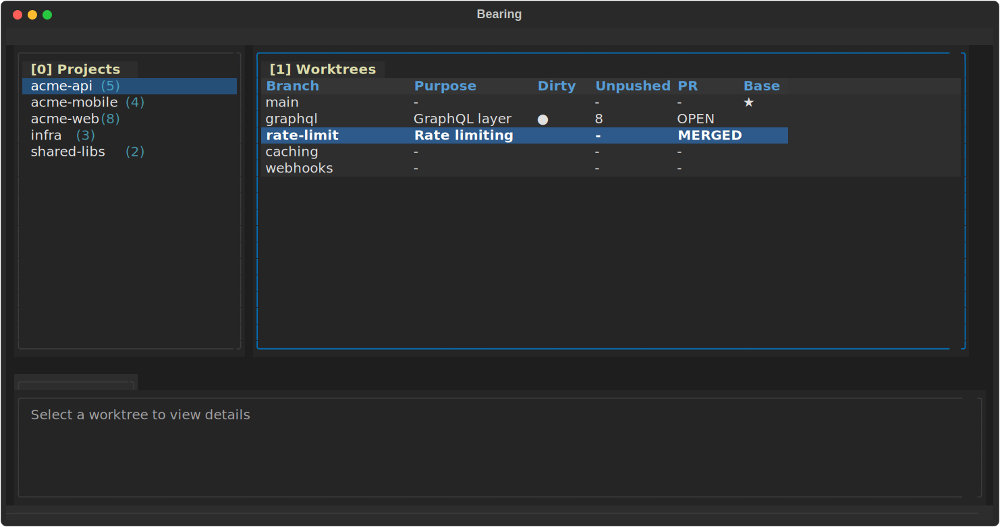

# Bearing TUI

> **Experimental:** This TUI is in early development.

Beautiful terminal UI for Bearing worktree management, inspired by lazygit.



## Requirements

- Python 3.10+
- Bearing workspace with state files (`local.jsonl`, `workflow.jsonl`)

## Installation

```bash
cd ~/Projects/bearing-tui/tui
make install-dev  # includes test dependencies
```

## Usage

```bash
# Run from anywhere in your workspace (auto-detects workspace root)
bearing-tui

# Or specify workspace explicitly
BEARING_WORKSPACE=~/Projects bearing-tui
```

The TUI will walk up the directory tree to find the workspace root (directory containing `local.jsonl` or `workflow.jsonl`).

## Layout

```
┌─ Bearing ──────────────────────────────────────────────────────┐
│ ┌─ [0] Projects ──┐ ┌─ [1] Worktrees ──────────────────────┐   │
│ │ ▶ bearing       │ │ BRANCH              DIRTY  PR  BASE  │   │
│ │   sailkit       │ │ ▶ go-rewrite        ●      OPEN      │   │
│ │   portfolio     │ │   docs-site               MERGED     │   │
│ └─────────────────┘ └──────────────────────────────────────┘   │
│ ┌─ [2] Details ──────────────────────────────────────────────┐ │
│ │ Folder: bearing-go-rewrite                                 │ │
│ │ Branch: go-rewrite  Purpose: Go rewrite of bearing CLI     │ │
│ │ Health: ● dirty • ↑ 2 unpushed • PR: OPEN                  │ │
│ └────────────────────────────────────────────────────────────┘ │
│ 0-2 panels  j/k nav  n]ew  c]leanup  r]efresh  d]aemon  ? help │
└────────────────────────────────────────────────────────────────┘
```

## Keybindings

Press `?` for full keybinding help.

| Key | Action |
|-----|--------|
| `0` / `1` / `2` | Focus panel by number |
| `j` / `↓` | Move down |
| `k` / `↑` | Move up |
| `h` / `←` | Focus left panel |
| `l` / `→` | Focus right panel |
| `Tab` | Next panel |
| `Enter` | Select item |
| `n` | New worktree |
| `c` | Cleanup worktree |
| `r` | Refresh data |
| `d` | Toggle daemon |
| `?` | Show help |
| `q` | Quit |

## Development

```bash
cd ~/Projects/bearing-tui/tui

# Install with dev dependencies
make install-dev

# Run the TUI
make run

# Run tests
make test

# Clean build artifacts
make clean
```

## Testing

The TUI uses [Textual's testing framework](https://textual.textualize.io/guide/testing/) for automated tests. Tests run headlessly and can simulate keypresses, verify widget state, and test the full application flow.

```bash
make test
# or
pytest -v
```

Example test:

```python
@pytest.mark.asyncio
async def test_keyboard_navigation(workspace):
    app = BearingApp(workspace=workspace)
    async with app.run_test() as pilot:
        # Press 2 to focus worktree table
        await pilot.press("2")
        assert isinstance(app.focused, WorktreeTable)
```

## Architecture

- **app.py** - Main Textual App with layout and keybindings
- **state.py** - Reads JSONL state files, auto-detects workspace
- **widgets/** - Reusable Textual widgets (ProjectList, WorktreeTable, DetailsPanel)
- **styles/app.tcss** - Textual CSS for Darcula-inspired theme
